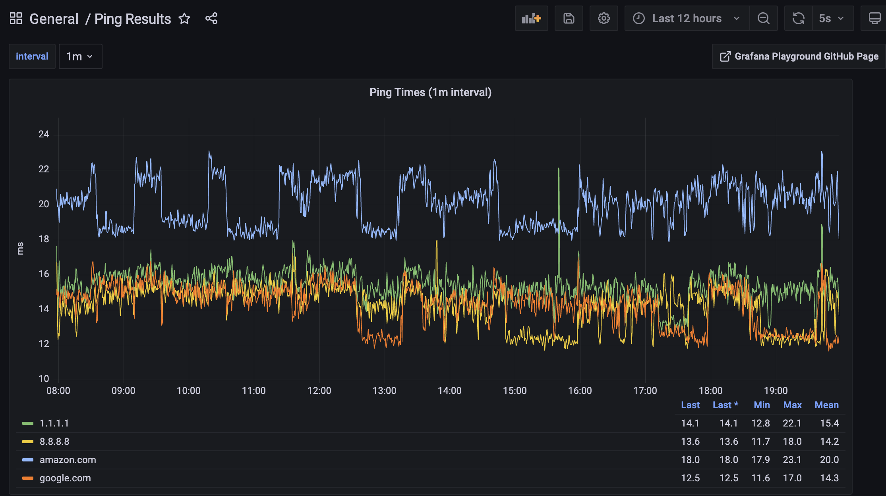
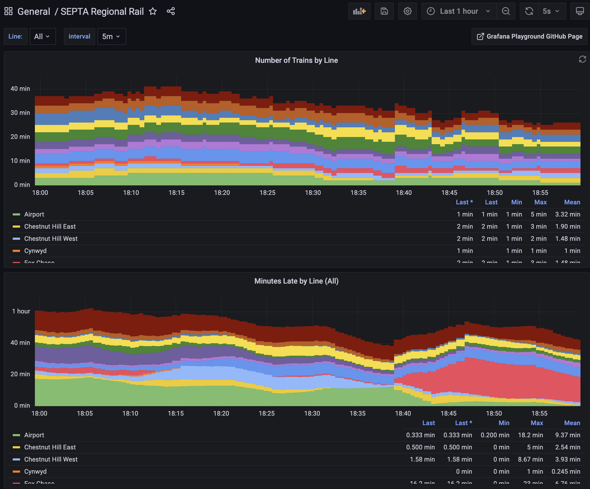
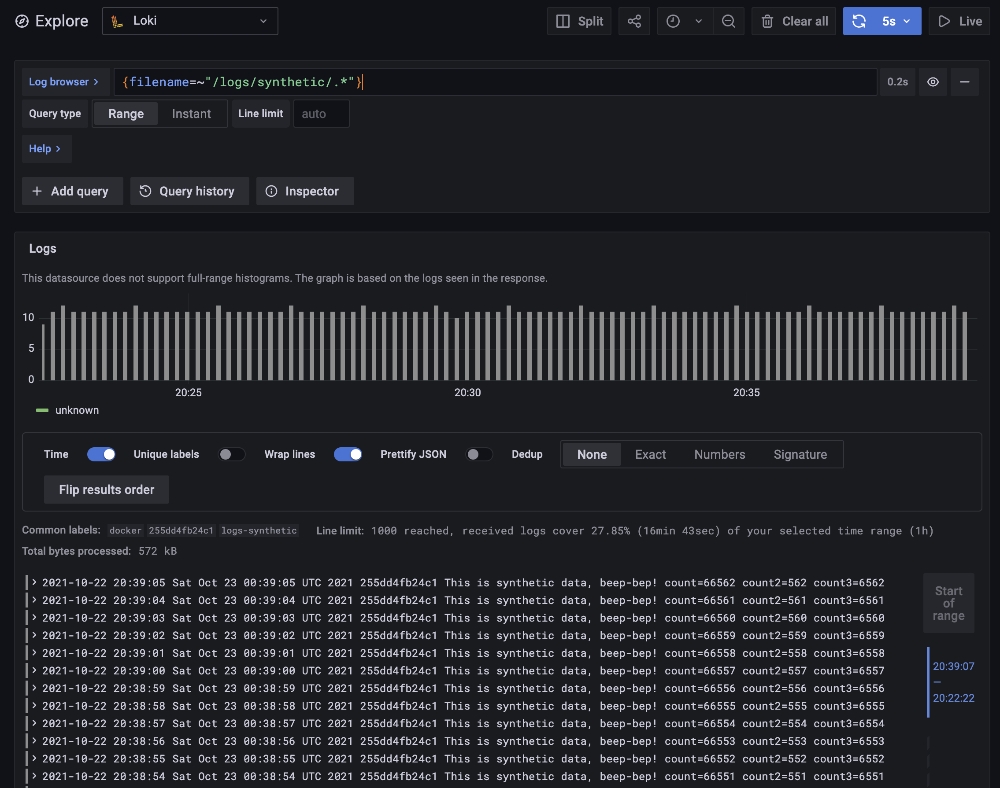
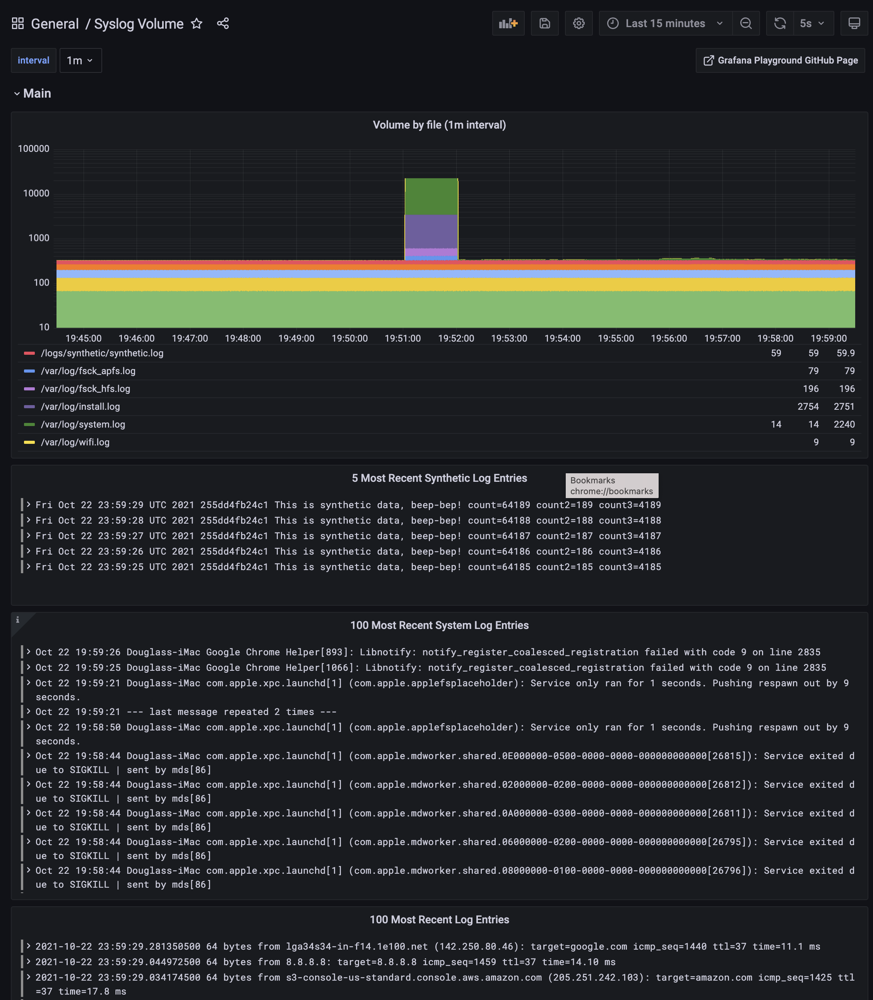

# Grafana Playground

This is a little project I put together that lets you spin up a Grafana ecosystem in Docker and automatically feed in syslogs to the Loki database and metrics to the Prometheus database.  That environment includes:

- Grafana, for graphing
- Loki, for storing time series logs
- Prometheus, for storing time series metrics
- `ping`, a container which pings multiple hosts
- `septa`, a container which [pulls train data from SETPA's API](http://www3.septa.org/api/)
- `telegraf`, a utility for reading system metrics, which it will then feed into both Grafana and Loki. ([Telegraf website](https://www.influxdata.com/time-series-platform/telegraf/))
- A Docker container called `logs`, which automatically generates synthetic log entries.
- Promtail, for reading in the generated logs, output of `ping`, as well as the contents of `/var/log/`. All logs are sent off to loki.
- [A script](docker/ping-metrics/python-prometheus-metrics.py) which implements `tail -F` in Python. ([Stand alone demo script here](docker/ping-metrics/python-tail-logs.py))

## Getting Started

- Run `docker-compose up` to start up the environment.
- Go to http://localhost:3000/ and log into Grafana with login/pass of `admin/admin`.
- [Create an API with Admin access](http://localhost:3000/org/apikeys)
- Spawn a shell in the `tools` container and import the dashboards and data sources into Grafana
  - `docker-compose exec tools bash`
  - `cat /mnt/config/dashboards.json | /mnt/bin/manage-dashboards.py --import --api-key API_KEY`
  - `/mnt/bin/manage-data-sources.py --api-key API_KEY`
  - Type `exit` to exit the shell in that container
- At this point, your Data Source (Loki and Prometheus) and Dashboards have been loaded, with the latter available at http://localhost:3000/dashboards.

## List of Endpoints

- http://localhost:3000/ - Local Grafana instance. Login and pass are `admin/admin`.
- http://localhost:3100/ - Local Loki instance.  Check http://localhost:3100/ready to see if the instance is ready.
- http://localhost:9081/targets - Targets page for the (Dockerized) instance of promtail.

## Viewing Dashboards

### The Ping dashboard

Look, just start with the ping dashboard, okay?

- [Ping Results](http://localhost:3000/d/WiThvuS7z/ping-results) - Shows ping time and packet loss for specified hosts.  The hosts can be changed.

Yeah, so you loaded the dashboard, and it's showing the results of pinging multiple hosts on the Internet (round-trip time and packet loss) on a dashboard that gets updated every 5 seconds!  Neat, huh?

### Other dashboards

Here are a few other dashboards which show details about the running system:

- [Ping Results, but from Prometheus](http://localhost:3000/d/WQwTEyd7z/ping-results-from-prometheus) - Similar to the original ping dashboard, this pulls metrics from Prometheus, which are aggregated, and the results will be in lower resolution.
- [Syslog Volume](http://localhost:3000/d/fponVrV7z/syslog-volume) - Covers syslog, synthetic logs, and ping events.
- [Docker Logs](http://localhost:3000/d/RQVYi6V7k/docker-logs) - This playground ingests logs from its own Docker containers, which can be viewed here.
- [Loki Stats](http://localhost:3000/d/ZDiuJmN7k/loki-stats) - Statistics on the Loki Database
- [Promtail Stats](http://localhost:3000/d/Xp2dJmH7k/promtail-stats) - Statistics on the Promtail instance
- [Docker Host Stats](http://localhost:3000/d/xHVqHGv7k/docker-host-stats-prometheus) - System Metrics from Prometheus (fed in by Telegraf)
- [SEPTA Regional Rail Stats](http://localhost:3000/d/U2n119O7z/septa-regional-rail) - Stats on [SEPTA Regional Rail](http://www.septa.org/service/rail/)

## Pinging Additional Hosts

- Optionally edit the file `hosts.txt` to add human-readable names for IP addresses.
- Copy `docker-compose.override.yml.sample` to `docker-compose.override.yml`.
- Uncomment the `environment:` and `HOSTS:` keys.
- Add additional hosts or IPs into `HOSTS:` as you see fit.
- Restart the `ping` container with `docker-compose kill ping; docker-compose rm -f ping; docker-compose up -d ping`.

## Exporting Dashboards

- If you want to export your current set of dashboards (including any changes made) to disk, first you'll need launch a shell in the tools container:
  - `docker-compose exec tools bash`
- Now, using your API key, run the script to export dashboards into `dashboards.json` in the current directory:
  - `/mnt/bin/manage-dashboards.py --export --api-key API_KEY > /mnt/dashboards.json`
  - If you get an HTTP 401 error, it means your API key was invalid.

## Running Ad-hoc Queries

- To run a specific query, click the `Compass` on the left which puts you into `Explorer Mode`.
  - Then paste in this query: `{ filename=~"/logs/synthetic/.*" }`.
  - That should immediately show you the most recent logs that have been written. If this shows nothing, then data is not making it into Loki.

## Manually Injecting Logs

If you want to manually inject an arbitrary number of logs, that can be done with this command:

- `docker-compose run logs n`

Replace `n` with the number of logs you want to write.  They will go into the file `/logs/synthetic/manual.log`
in the `logs` volume, which will then be picked up by the `promtail` container.  They can be viewed
in Grafana with this query:

- `{filename=~"/logs/synthetic/manual.log"}`

## Changing Which Hosts are Pinged

- Edit `docker-compose.yml`
- Change the `HOSTS` variable for the `ping` container.
- Restart the `ping` container with `docker-compose kill ping; docker-compose up -d ping`
- Current hosts being pined can be inspected with `docker inspect grafana-playground_ping_1 | jq .[].Config.Env` (adjust the container name accordingly).

## Considerations for Mac Users

For whatever reason, I have not had any luck mapping `/var/log/` on my Mac to a Docker container.  
I tried a bunch of different things, but no luck.  I ended up coming up with a workaround, which
is to install and run Promtail locally:

- `brew install promtail`
- `./bin/run-local-promtail.sh` - Run this locally to send logs to the Dockerized version of Loki.

## Command Line Utilities

If you want to query Loki directly, I write a command-line script for that:

- `./bin/query.sh` - Query the Dockerized instance of Loki on the command line.
  - Examples:
    - `./bin/query.sh '{job="logs-ping"}'`
    - `./bin/query.sh '{job="logs-ping"}' 5`
    - `./bin/query.sh '{job="logs-ping",host="docker"}'`
    - `./bin/query.sh '{job="logs-ping",filename="/logs/ping/google.com.log"}'`
    - `./bin/query.sh '{job="logs-ping",filename=~"/logs/ping.*"}'`
    - `./bin/query.sh '{job="logs-ping",filename=~"/logs/ping.*"}' 10`

## List of Docker Containers and Their Functions

- `ping` - Pings one or more hosts continuously and writes the results to logfiles in a Docker voluem
- `ping-metrics` - Reads ping's logfiles and exports them to Prometheus via a webserver.
- `septa` - Pulls Regionail Rail train data from SEPTA's API once a minute and writes it to a log for ingestion by Loki.
- `prometheus` - Promtheus instance
- `grafana` - Grafana instance.
- `logs` - Container to make fake logs for testing Loki.
- `loki` - Loki instance.
- `telegraf` - Telegraf instance which exports system metrics to Prometheus.
- `promtail` - Tails logs from various other containers, as well as `/var/log/` on the host filesystem.
- `tools` - Container to run tools from.  It normally does nothing, to make use of it run `docker-compose exec tools bash` to spawn a shell, at which point the rest of the environment can be talked to using the container name as hostname.

## Sending Docker Logs to Loki

Docker normally writes standard output from its containers to a file.  However, standard output
can also be sent somewhere else... such as Loki.  Even the output from Loki can be sent back to itself!
Here's how to do that:

- First, install the Docker plugin to talk to Loki:
  - `docker plugin install grafana/loki-docker-driver:latest --alias loki --grant-all-permissions`
- Now, make a copy of `docker-compose.override.yml.sample` to `docker-compose.override.yml`:
  - `cp -v docker-compose.override.yml.sample docker-compose.override.yml`
  - `docker-compose.override.yml` is excluded with `.gitignore` so changes made be made to it.
- If you are currently running any containers, you must kill and restart them as follows:
  - `docker-compose kill logs; docker-compose up -d logs`
- You can verify the container is sending its logs to Loki with a command similar to:
  - `docker inspect grafana-playground_logs_1 | jq .[].HostConfig.LogConfig`
- From there, you can view logs from all your containers in Grafana with this query:
  - `{host="docker-desktop"}`
- To import the dashboard for viewing Docker logs:
  - Hover over the plus sign (`+`) on the left, click `Import`.
    - Click `Upload JSON file` and navgiate to the file `config/log-volume-dashboard.json`, then click `Import`.
  - The dashboard should now show a breakdown of all log volumes.

More about how to configure the Docker Loki plugin [can be read here](https://grafana.com/docs/loki/latest/clients/docker-driver/configuration/).

## Additional Considerations

- For Loki, I set `min_ready_duration` to be 5 seconds so that the database is ready quicker.
  - I would not recommend this setting for production use.
- Loki is not configured to save logs to S3 or any other object store--everything is on the local disk.
- There are some label extractions in `config/promtail-config-docker.yaml` which are commented out.
  - Feel free to uncomment them if you want to expirment with labels, but be advised the number of streams is the *product* of how many different label values you can have, which can cause performance issues.  That is explained more [in this post](https://grafana.com/blog/2020/08/27/the-concise-guide-to-labels-in-loki/)
  - TL;DR If you go crazy with labels and try to Index a high-cardinality field, you're gonna have a bad time!

## Frequently Asked Questions (FAQ)

#### Q: How are you pinging multiple hosts in the `ping` container? Are you running multiple copies of `ping`?

A: Yes, I am.  I used the excellent [Daemontools package](https://cr.yp.to/daemontools.html) to a separate service for each host that is being pinged.  Daemontools handles restarting of ping when it exits in a safe and sane way.

#### Q: But why multiple processes in a single container?  That's not a best practice in Docker!

A: It was a judgement call, I felt that if I was pinging say, 10 different hosts, having 10 different containers all doing the same function would be a little unwieldly.  Instead, it made more sense to me to keep all of that functionality under a single container.

#### Q: I see you're getting packet loss stats every 10 seconds.  What about the overhead in stopping and starting a `ping` process every 10 seconds?

A: That's not an issue, because I don't do that. :-)  Instead, [I hacked the ping utility](https://github.com/dmuth/iputils), and added in some code to print out the number of packets sent/received every 10 seconds.  [My script that parses those values](docker/ping-metrics/python-prometheus-metrics.py) then computes a packet loss value, and exports it to Prometheus. (For Loki, the packet loss is computed at query time with LogQL)

I used this technique before for [my Splunk network health app](https://github.com/dmuth/splunk-network-health-check) and it works quite well.

## Development

- Working on the `logs` container
  - `docker-compose kill logs; docker-compose rm -f logs; docker-compose build logs && docker-compose up logs`
- Working on the `promtail` container
  - `docker-compose kill promtail; docker-compose rm -f promtail; docker-compose build promtail && docker-compose up promtail`

## What Comes Next?

If you made it here, congrats, you now have a pretty thorough understanding of the Grafana Ecosystem and Loki!
Maybe you could submit a PR to help me with my TODO list. :-)

## TODO List

- Alerts!
  - Alerta integration?
  - Slack integration?
- More metrics?
  - Temperature in Philadelphia?
  - BitCoin price? (Ew...)
  - Fake webserver logs with [flog](https://github.com/mingrammer/flog) or similar...?
- System metrics?
  - Can I run node_exporter or Telegraf and get metrics from the system itself?
- Clustering with Loki?

## Credits

- [This blog post](https://avleonov.com/2020/06/10/how-to-list-create-update-and-delete-grafana-dashboards-via-api/) by Alexander V. Leonov that talks about how to use the Grafana API.
- [Telegraf & Prometheus Swiss Army Knife for Metrics](https://blog.nobugware.com/post/2016/telegraf_prometheus_metrics_swiss_army_knife/) - by Fabrice Aneche that helped me get started with Telegraf and reading the data from Prometheus.
- [Prometheus Metrics and Instrumentation](https://sysdig.com/blog/prometheus-metrics/) - I learned how to build a Python-based webserver to export metrics to Prometheus with this post.
- [prometheus-client module for Python](https://github.com/prometheus/client_python)
- [How Does a Prometheus Summary Work?](https://www.robustperception.io/how-does-a-prometheus-summary-work)

